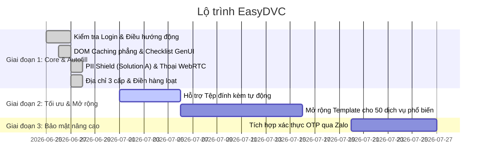

# Project Roadmap & Changelog

Tài liệu này theo dõi tiến độ phát triển của dự án **EasyDVC** theo các cột mốc quan trọng.

## 1. Lộ trình phát triển (Development Roadmap)

### Chi tiết các giai đoạn:

#### Giai đoạn 1: Trợ lý lõi & Tự động hóa Biểu mẫu (Hiện tại - Đã hoàn thành 100%)
*   [x] Thiết lập kết nối thoại WebRTC OpenAI Realtime rảnh tay (VAD).
*   [x] Phát hiện trạng thái đăng nhập và điều hướng thông minh không hardcode.
*   [x] Giảm 95% token sử dụng qua cơ chế DOM Caching tĩnh theo URL.
*   [x] Triển khai PII Shield mã hóa CCCD/SĐT cục bộ kèm Modal xác nhận trực quan (Solution A).
*   [x] Tự động hóa điền địa chỉ hành chính 3 cấp vượt trễ AJAX.

#### Giai đoạn 2: Tối ưu hóa trải nghiệm & Mở rộng dịch vụ (Kế hoạch tiếp theo)
*   [ ] Phát triển công cụ tự động tải lên tài liệu đính kèm (sổ hộ khẩu, giấy khai sinh...).
*   [ ] Xây dựng thư viện templates DOM caching hỗ trợ 50 dịch vụ công thiết yếu khác.
*   [ ] Tối ưu hóa phụ đề giọng nói mượt mà hơn.

#### Giai đoạn 3: Đồng bộ & Xác thực nâng cao (Kế hoạch tương lai)
*   [ ] Kích hoạt lại kênh đồng bộ Zalo OTP bảo mật khi hệ thống backend sẵn sàng.
*   [ ] Đóng gói và phát hành Extension lên Chrome Web Store.

---

## 2. Nhật ký thay đổi (Changelog)

### [Phiên bản 1.0.0] - 2026-06-27
*   **Thêm mới**: Tạo trang mockup `test-dvc-cascading.html` để kiểm thử cục bộ mượt mà.
*   **Thêm mới**: Lớp `PIIShield` quét regex số CCCD & SĐT và hiển thị modal xác nhận cục bộ trước khi AI thực hiện điền.
*   **Cải tiến**: Loại bỏ việc quét DOM thô, thay bằng bộ đệm mẫu `DVC_FORM_TEMPLATES` giúp giảm chi phí token.
*   **Cải tiến**: Thiết lập hàm `fillAddressCascading` dùng cơ chế thăm dò đợi dropdown con tải xong mới chọn tiếp.
