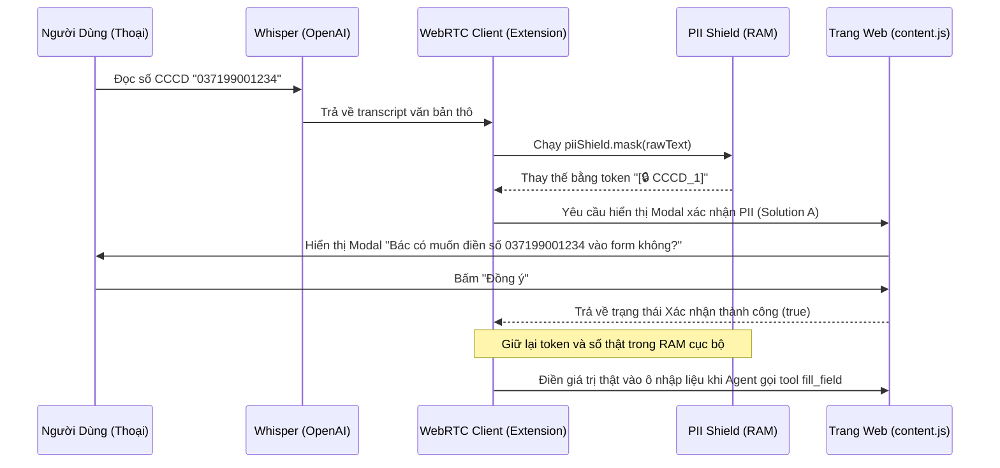

# System Architecture

Hệ thống **EasyDVC** sử dụng kiến trúc phân lớp kết hợp mô hình Hybrid Client-Agent để tối đa hóa tốc độ phản hồi và bảo vệ thông tin nhạy cảm.

## 1. Sơ đồ kiến trúc tổng quan (High-Level Architecture)

Hệ thống có thể chạy dưới 2 chế độ độc lập hoặc song song:

```
[Người dùng (Giọng nói)]
        │
        ▼
┌────────────────────────────────────────────────────────┐
│               CHROME EXTENSION (CLIENT)                │
│                                                        │
│  ┌─────────────────┐           ┌────────────────────┐  │
│  │  Voice Widget   │◄─────────►│   webrtc-client    │  │
│  │  (Giao diện nổi)│           │   (WebRTC Core)    │  │
│  └─────────────────┘           └─────────┬──────────┘  │
│                                          │             │
│                                          ▼             │
│  ┌─────────────────┐           ┌────────────────────┐  │
│  │   PII Shield    │◄─────────►│     content.js     │  │
│  │ (Mã hóa cục bộ) │           │ (Tương tác DOM/UI) │  │
│  └─────────────────┘           └────────────────────┘  │
└────────────────────────────────────────────────────────┘
        ▲                                  ▲
        │ (Kênh WebSocket Bridge)          │ (Kết nối WebRTC trực tiếp)
        ▼                                  ▼
┌────────────────────────┐       ┌────────────────────────┐
│     BACKEND PYTHON     │       │     OPENAI REALTIME    │
│  (agent_server.py)     │       │          API           │
└────────────────────────┘       └────────────────────────┘
```

---

## 2. Luồng xử lý PII Shield & Xác thực cục bộ (Solution A)

Khi người dùng nói các thông tin nhạy cảm như số CCCD hay số điện thoại, quy trình bảo mật diễn ra như sau:



---

## 3. Kiến trúc Tương tác DOM & Caching
*   **DOM Caching**: Khi bắt đầu phiên, content script lấy URL của trang hiện tại. Nếu khớp với `/dvc-tthc-dang-ky-thuong-tru` hoặc `/dvc-tthc-cap-lai-the-bhyt`, hệ thống sẽ nạp trực tiếp cấu trúc DOM rút gọn từ `DVC_FORM_TEMPLATES` mà không cần duyệt cây DOM thực tế của trang web.
*   **Trình điền địa chỉ hành chính 3 cấp (Cascading Dropdown)**: 
    *   Hàm `fillAddressCascading` thực hiện thay đổi giá trị của dropdown `#prov`, sau đó chạy vòng lặp kiểm tra thuộc tính `options.length` của `#dist` mỗi 200ms (tối đa 2 giây).
    *   Sau khi `#dist` được nạp, tiếp tục chọn Huyện và kiểm tra thuộc tính `options.length` của `#ward`.
    *   Cuối cùng chọn Xã/Phường để hoàn tất.
